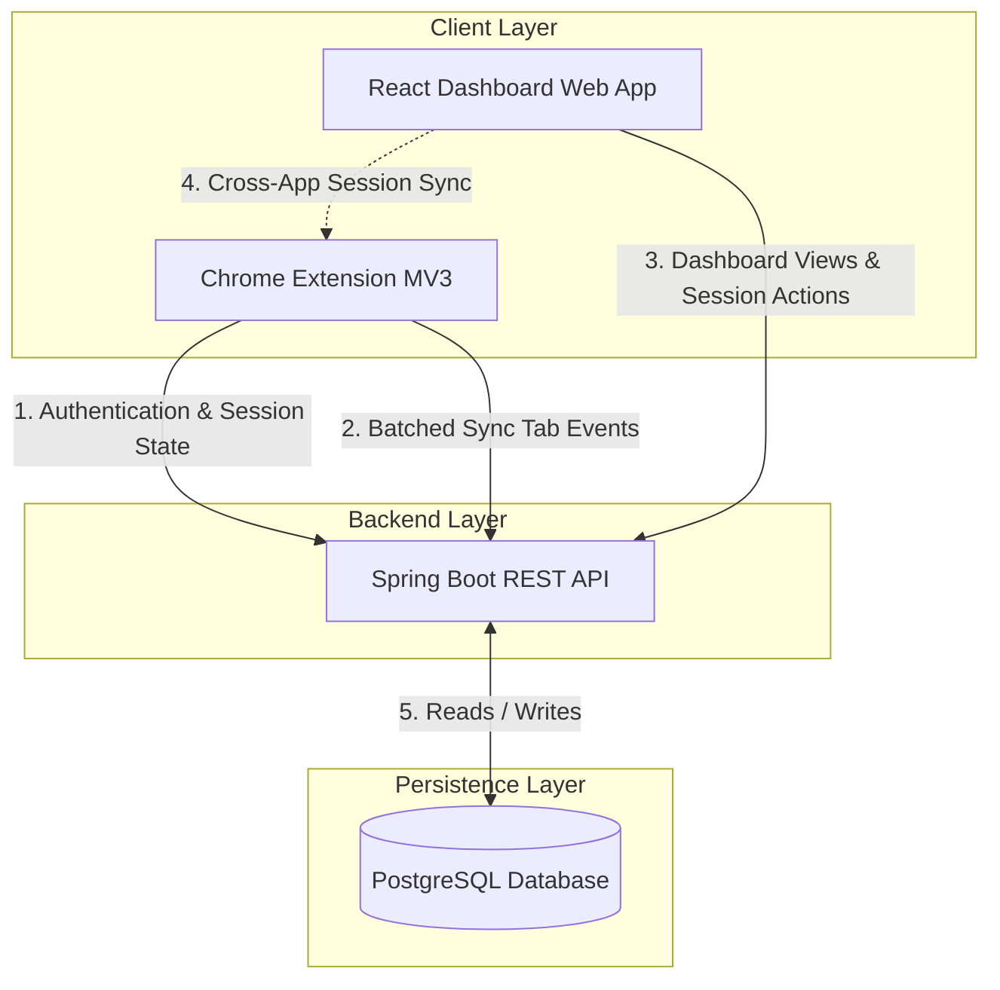
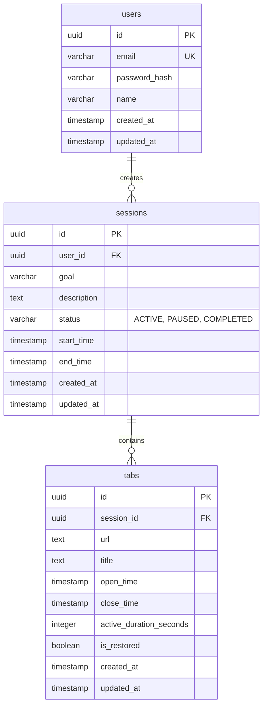
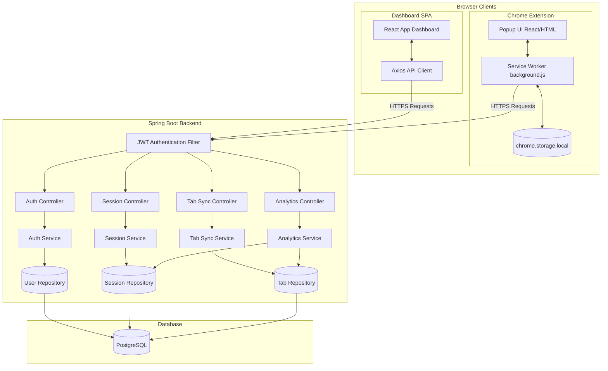
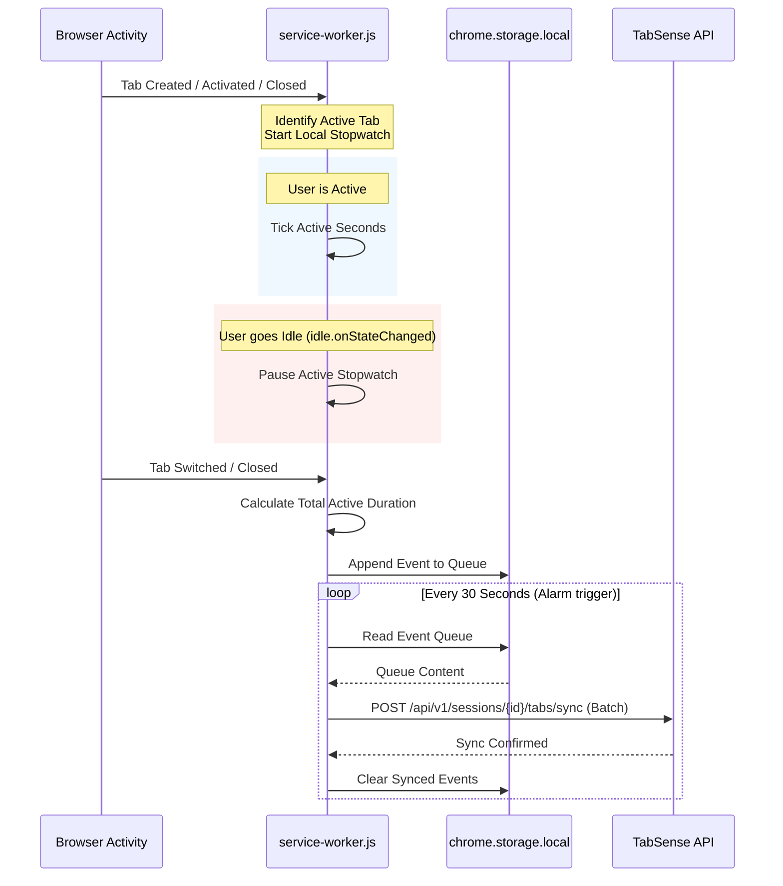
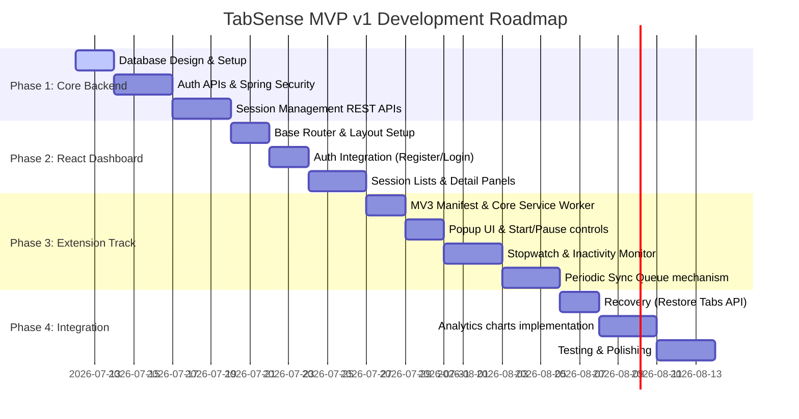

# System Architecture and Design for TabSense (MVP v1)

TabSense is a Context Preservation Platform designed to capture the purpose behind browsing sessions, automatically track related browser activity, and enable users to resume unfinished work without losing context. 

This document outlines the system architecture, folder structure, database schema, API design, component architecture, browser extension specifications, React component hierarchy, security practices, deployment strategy, and development roadmap.

---

## 1. Overall System Architecture

TabSense uses a decoupled client-server architecture. The backend is built using Spring Boot and exposes a secure REST API. It is decoupled from Chrome-specific logic to allow support for other browser clients (Firefox, Edge, etc.) in the future. The frontend consists of a React Dashboard and a Manifest V3 Chrome Extension.



### High-Scale Event Synchronization Flow
Chrome extensions can generate high frequencies of tab tracking events (e.g. opens, closes, updates, focus changes). To prevent database connection depletion and unnecessary network traffic:
1. **Local Queueing**: The Chrome Extension buffers tab activity events in browser local storage (`chrome.storage.local`).
2. **Periodic Synchronization**: A background alarm flushes these queued events in a single batch API request every 30 seconds, or immediately when a session is explicitly paused, completed, or window focus is lost.
3. **No Message Queue / Caching in MVP**: To keep the MVP streamlined and robust, the backend processes batch inserts synchronously using Spring Data JPA batch updates, eliminating the need for Redis/RabbitMQ infrastructure in Version 1.

---

## 2. Folder Structure

We propose a monorepo structure to keep the backend, dashboard, and browser extension close together, allowing simple local development.

```
tabsense/
├── tabsense-backend/             # Spring Boot REST API
│   ├── src/
│   │   ├── main/
│   │   │   ├── java/com/tabsense/
│   │   │   │   ├── config/       # Security (JWT, CORS, BCrypt)
│   │   │   │   ├── controller/   # REST Controllers (Auth, Session, Sync, Analytics)
│   │   │   │   ├── dto/          # Request/Response Data Transfer Objects
│   │   │   │   ├── model/        # JPA Entities (User, Session, Tab)
│   │   │   │   ├── repository/   # JPA Repositories
│   │   │   │   └── service/      # Business logic services
│   │   │   └── resources/
│   │   │       └── application.yml
│   │   └── test/                 # JUnit/Mockito Unit & Integration Tests
│   ├── pom.xml
│   └── Dockerfile
│
├── tabsense-dashboard/           # React Single Page Application (Vite)
│   ├── src/
│   │   ├── assets/               # CSS, Icons, Fonts
│   │   ├── components/           # Reusable UI elements (Charts, SessionCard, Button)
│   │   ├── context/              # Context Providers (AuthContext, ActiveSessionContext)
│   │   ├── hooks/                # Custom React hooks (useAuth, useSession)
│   │   ├── layouts/              # App layout wrappers (DashboardLayout)
│   │   ├── pages/                # Pages (Dashboard, SessionDetail, Login, Register)
│   │   ├── services/             # API client services (Axios instance)
│   │   ├── utils/                # Chart configurations, date helpers
│   │   ├── App.css
│   │   ├── App.tsx
│   │   └── main.tsx
│   ├── package.json
│   ├── tsconfig.json
│   ├── vite.config.ts
│   └── Dockerfile
│
└── tabsense-extension/           # Chrome Extension (Manifest V3)
    ├── manifest.json             # Manifest V3 configurations
    ├── icons/                    # App icons (16px, 48px, 128px)
    ├── background/
    │   └── service-worker.js     # Tab tracking, local storage queue, periodic sync alarm
    ├── popup/
    │   ├── popup.html
    │   ├── popup.css
    │   └── popup.js              # Extension UI (Start, Pause, Resume, Active Session details)
    └── utils/
        └── api.js                # API request helpers (authentication and syncing)
```

---

## 3. Database Schema (PostgreSQL)

The MVP database contains three core entities: **User**, **Session**, and **Tab**.



### Relational Mapping
* **One User → Many Sessions**: A user can run multiple goal-based sessions over time.
* **One Session → Many Tabs**: Each session captures the tabs open/visited during its active timeframe.

### Database Performance Indexes
To ensure fast reads during session recovery and dashboard loading:
* **`idx_sessions_user_status`**: B-Tree index on `sessions(user_id, status)` – Speeds up finding the active/paused sessions for a user.
* **`idx_tabs_session_id`**: B-Tree index on `tabs(session_id)` – Crucial for restoring all associated tabs of a session.
* **`idx_tabs_url_host`**: Expression index on host/domain extracted from `url` (e.g. `split_part(url, '/', 3)`) – Allows fast aggregation of top domains in analytics.

---

## 4. API Design

All endpoints are versioned with prefix `/api/v1`. Except for public registration and login routes, all endpoints require a valid JWT header: `Authorization: Bearer <JWT_TOKEN>`.

### Authentication Endpoints
* **`POST /api/v1/auth/register`**
  * **Request**: `{ "email": "user@test.com", "password": "securepassword", "name": "John Doe" }`
  * **Response**: `201 Created`
  * **Body**: `{ "token": "JWT_STRING", "user": { "id": "uuid", "email": "user@test.com", "name": "John Doe" } }`
* **`POST /api/v1/auth/login`**
  * **Request**: `{ "email": "user@test.com", "password": "securepassword" }`
  * **Response**: `200 OK`
  * **Body**: `{ "token": "JWT_STRING", "user": { "id": "uuid", "email": "user@test.com", "name": "John Doe" } }`

### Session Management Endpoints
* **`POST /api/v1/sessions`**
  * **Request**: `{ "goal": "Learn Spring Security", "description": "Studying JWT filters" }`
  * **Response**: `201 Created`
  * **Description**: Starts a new goal-based session. Automatically transitions any current `ACTIVE` session for this user to `PAUSED`.
* **`GET /api/v1/sessions`**
  * **Params**: `status` (optional), `page` (default 0), `size` (default 10)
  * **Response**: `200 OK` – Paginated list of sessions (excluding associated tabs list to keep payload light).
* **`GET /api/v1/sessions/{id}`**
  * **Response**: `200 OK` – Detailed session object including list of associated tabs.
* **`PATCH /api/v1/sessions/{id}/status`**
  * **Request**: `{ "status": "PAUSED" }` or `{ "status": "COMPLETED" }` or `{ "status": "ACTIVE" }`
  * **Response**: `200 OK` – Updated session configuration. Resuming a session (setting status back to `ACTIVE`) automatically pauses other active sessions.
* **`DELETE /api/v1/sessions/{id}`**
  * **Response**: `204 No Content` – Cascades deletion to related tab records.

### Tab Ingestion & Sync Endpoints
* **`POST /api/v1/sessions/{id}/tabs/sync`**
  * **Request**: 
    ```json
    {
      "events": [
        {
          "url": "https://spring.io/projects/spring-security",
          "title": "Spring Security",
          "open_time": "2026-07-11T12:00:00Z",
          "close_time": "2026-07-11T12:05:00Z",
          "active_duration_seconds": 300,
          "is_restored": false
        }
      ]
    }
    ```
  * **Response**: `200 OK` – `{ "synced": 1 }`
  * **Description**: Receives batched events from the Extension, inserting new tabs or updating existing ones based on session context.

### Analytics Endpoints
* **`GET /api/v1/analytics/overview`**
  * **Response**: `200 OK`
  * **Body**:
    ```json
    {
      "activeSessionsCount": 1,
      "completedSessionsCount": 8,
      "totalResearchTimeSeconds": 28800,
      "timeSpentPerSession": [
        { "sessionId": "uuid-1", "goal": "Learn Spring Security", "seconds": 7200 },
        { "sessionId": "uuid-2", "goal": "React Router setup", "seconds": 3600 }
      ]
    }
    ```
* **`GET /api/v1/analytics/top-domains`**
  * **Response**: `200 OK`
  * **Body**:
    ```json
    [
      { "domain": "github.com", "activeDurationSeconds": 14400, "visitCount": 42 },
      { "domain": "stackoverflow.com", "activeDurationSeconds": 7200, "visitCount": 18 }
    ]
    ```

---

## 5. Component Diagram



---

## 6. Browser Extension Architecture (MV3)

The Chrome Extension is structured around Manifest V3 to optimize memory and battery footprints while maintaining strict background monitoring.

### Permissions Required (`manifest.json`)
* `"tabs"`: To inspect open tab metadata (URLs, titles) and to perform session recovery.
* `"storage"`: Local persistent buffering queue for off-line/periodic sync.
* `"idle"`: Used to detect system inactivity (locks/screensavers) so tab timers can pause.
* `"alarms"`: To trigger background sync intervals.
* `host_permissions`: Access limited to the TabSense backend server origin.

### Extension Logic Workflow



### Tab Restoring Mechanism (Session Recovery)
When the user clicks "Restore Session" in either the popup or dashboard:
1. The client retrieves the list of tabs associated with the selected session.
2. The extension iterates through the URLs and creates new browser tabs via `chrome.tabs.create({ url: tab.url })`.
3. Optionally, the active session is set to this restored session, and tracking resumes automatically.

---

## 7. React Component Hierarchy

```
App
├── AuthProvider (JWT Context)
├── SessionProvider (Active Session Context)
└── Router
    ├── LoginPage (Unauthenticated)
    ├── RegisterPage (Unauthenticated)
    └── DashboardLayout (Authenticated Layout)
        ├── NavigationBar (Profile, Logout)
        ├── Sidebar (Session quick list, status filters)
        └── MainContentPanel
            ├── DashboardOverview (Default view)
            │   ├── StatCardsGrid (Total Time, Active/Completed counters)
            │   ├── AnalyticsCharts (Time per session, top domains)
            │   └── ActiveSessionBanner (Displays current goal, quick action controls)
            ├── SessionDetailsView (Detailed session inspection)
            │   ├── SessionHeader (Goal title, Description, Start/End timestamp, Controls)
            │   ├── TabListTable (Active duration, state, url, title)
            │   └── SessionActionsPanel (Button to "Restore All Session Tabs")
            └── SessionHistoryView (List of previous sessions)
                └── SessionHistoryTable (Paginated history with status badges)
```

---

## 8. Security Considerations

1. **JWT Auth & Expiration**: JWT tokens are signed using a HS256 key configured on the Spring Boot server. Tokens expire in 24 hours. They are securely cached in client local storage and sent via header `Authorization: Bearer <token>`.
2. **Password Safety**: User passwords are encrypted using `BCryptPasswordEncoder` in Spring Security. Raw passwords are never stored in the database.
3. **CORS Handling**: Spring Security configuration strictly limits CORS policies to allowed origins: the React Dashboard URL and the unique Chrome Extension UUID (`chrome-extension://<id>`).
4. **Data Isolation**: Database queries are written so that all session and tab operations require the authenticated `user_id` context. Users cannot view, update, or sync tabs into sessions belonging to other users.
5. **Content Security Policy (CSP)**: The browser extension strictly implements the MV3 CSP default, preventing the execution of unsafe remote scripts.

---

## 9. Deployment Strategy

TabSense is designed to run in Docker containers for simple environment replication and deployment.

* **Backend API**: 
  * Dockerized Spring Boot (JDK 17) jar file.
  * Deployed on Render, Heroku, or AWS App Runner.
* **Frontend Dashboard**:
  * React SPA built via Vite to static HTML/JS/CSS bundle.
  * Hosted on CDN-backed static hosts (Vercel, Netlify, or AWS S3 + CloudFront).
* **Database**:
  * Deployed on managed PostgreSQL instances (Supabase, AWS RDS, or Render Postgres).
* **Browser Extension**:
  * Packed as a standard `.zip` archive containing manifest, background worker, popup HTML/JS, and assets.
  * Published to the Chrome Web Store (configured in Developer Mode for testing).

---

## 10. Suggested Development Roadmap


